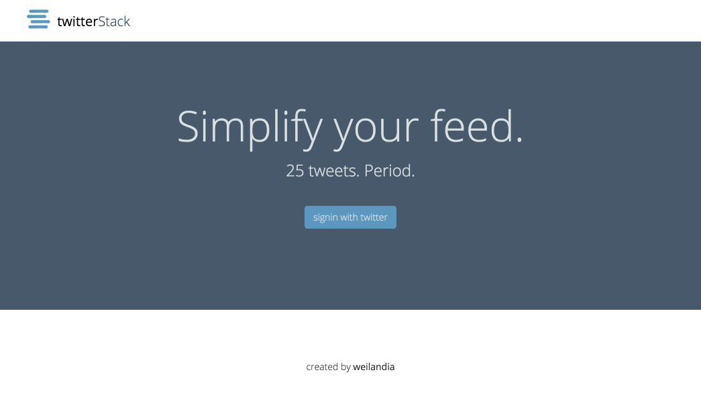

#twitterStack

twitterStack is a small app built for a code challenge that uses the Twitter API to display the last 25 tweets of any Twitter user via the endpoint ```/users/:twitter_handle```.

Production is hosted [here](http://twitterstack.herokuapp.com).



###Design
The basic workflow for users of twitterStack is to login via twitter and navigate to various Twitter users twitterStack pages, where they will see the last twenty-five tweets for any one user. Users can also click on mentions, which will redirect to twitterStack user pages, and they can click on tweet links, media, and hashtags, which will redirect to outside sites.

The controller design consists of three separate controllers:

1. StaticPages:
    * Routes to the home action, which simply renders the landing page.

2. SessionsController:
    * Routes to create and destroy actions, which facilitate the Twitter OAuth handshake process.

3. UsersController:
    * Routes to the show action, which handles the majority of the app's functionality:

        1. ```@twitter_service``` is created by instantiating a new TwitterService object.  This object, in turn, instantiates the Twitter API client, which allows us to interact with Twitter user data via the endpoints ```/api.twitter.com/1.1/users/:screen_name/show``` and ```/api.twitter.com/1.1/statuses/user_timeline```.

        2. ```@user``` is defined via ```params[:screen_name]```, which we will use in conjunction with ```@twitter_service``` to render a view with Twitter user data.

        3. On line 6 of the UsersController, we make our first call to the Twitter API with the method ```!@twitter_service.user(@user)```.  This method returns false if the passed in user does not exist, which is used to route the current user back to their home page if they search for a user that does not exist.

        4. Once we define ```@twitter_service``` and ```@user```, we make two calls to the Twitter API in order to populate the data shown on the user show page.
            * We call ```TwitterService.user_timeline(user_screen_name)```, which returns an array of the passed in user's last 25 tweets, and use ```Rails.cache.fetch``` to cache the return value for the next 10 hours.
            * We call ```TwitterService.user(user_screen_name)```, which returns basic user information, which we also cache for the next 10 hours.

    * In the UsersController, we also route the the ```search``` action, which simply grabs the search param and routes back to ```Users#show``` using the search param. I'm not sure I love this pattern and would welcome alternative solutions.

Tweet Poro:

One of the more interesting components of this project was finding a way to parse the Twitter Tweet objects' text to include links for mentions, hashtags, urls, and media.

The solution I chose was to use a Tweet PORO that parses a tweet's full text for matching Twitter Tweet object attributes, which then get swapped out for html-ready formats. For example, the following method used in the Tweet PORO finds Twitter "mentions" and adds hyperlinks to them:

```
  def add_links_to_user_mentions
    @user_mentions.each do |mention|
      @text = @text.gsub("@#{mention.screen_name}", %(<a href="/users/#{mention.screen_name}" class="user-mention">@#{mention.screen_name}</a>))
    end
  end
```

###Setup

To setup twitterStack on your local machine, perform the following steps:

1. Clone repo to desired directory by running ```git clone https://github.com/weilandia/twitter_stack.git```

2. Cd into your twitterStack directory and run ```bundle install``` (if you do not have ruby 2.2.4 on your machine, you will also need to install it with ```rvm install 2.2.4```)

3. Login to the [Twitter API Apps console](https://apps.twitter.com/) and register twitterStack as a new app. For the "Website" field, enter ```http://127.0.0.1:9292``` and for the "Callback URL" field, enter ```http://127.0.0.1:9292/auth/twitter/callback```. Stay on this page, as you will need to retrieve the Twitter Consumer Key and Twitter Consumer Secret in a moment.

4. In your twitterStack directory, run the command ```figaro install```.  This will generate a file in ```app/config``` called ```.application.yml```.  In this file, recreate the below code:
    ```yml
    TWITTER_CONSUMER_KEY: your key
    TWITTER_CONSUMER_SECRET: your secret
    TWITTER_USER_OAUTH_TOKEN: we will fill in later
    TWITTER_USER_SECRET_TOKEN: we will fill in later
    TWITTER_USER_SCREEN_NAME: your Twitter handle
    TWITTER_USER_NAME: your name
    ```

5. In your twitterStack directory, run the command ```rails s``` and open a browser to ```localhost:3000```.  You should now see the twitterStack homepage. Click on "signin with twitter" to become a user.  You are now able to navigate the app on the front end, but there are still a few more necessary setup steps the fully interact with the app's test suite.

6. In your twitterStack directory, run the command ```rails c``` and then once you are in the console, run ```User.last```.  Here is where you can find the information to complete your ```.application.yml``` file.  There is a way to get your ```TWITTER_USER_OAUTH_TOKEN``` and ```TWITTER_USER_SCREEN_NAME``` from the Twitter API Apps interface, but the way described above helps you get acquainted with the app's workflow--Either way works.

7. Once you have filled out your ```.application.yml``` you can run the test suite with the command ```rspec```.  There's more information below on what's exactly happening when running the test suite.

###Deploy
twitterStack is deployed via Heroku and currently hosted [here](http://twitterstack.herokuapp.com). If you would like to deploy your version to Heroku, here's some tips:

* Read [this](https://devcenter.heroku.com/articles/getting-started-with-rails4). Following the steps in this tutorial will get you most of the way there. There are, however, some gotchas that you can save some time on:
    1. After you've created your Heroku app, if you would like to change the name Heroku provided, navigate to your Heroku App Dashboard, click on your app and then on settings, and there will be a field to change the name.  This part is easy enough, but afterwards, you need to remember to update your Heroku git remote with the following commands:
        * ```git remote rm heroku```
        * ```git remote add heroku your-new-heroku-git-url-here```

    2. Once your Heroku app is created, run the command ```heroku run rake db:setup``` to setup your Postgres database on Heroku.

    3. Lastly, remember to set your environment variables for production, or you will not be able to access the Twitter API.  There are a couple ways to do this:
        * From the command line using Figaro: This way is useful once you get used to using Heroku.  [Look up this method when you're at that point](https://github.com/laserlemon/figaro).
        * From the Heroku interface: Navigate to your app on your Heroku dashbord, click on settings, and then click on ```Reveal Config Vars```.  At this screen you will need to enter two keys: ```TWITTER_CONSUMER_KEY``` and ```TWITTER_CONSUMER_SECRET```.  To get the values for these keys, register a new Twitter APP for your production app (setting the url and callback base url both with your Heroklu base url) and use the provided key and secret here on Heroku.

###Test
Testing for twitterStack uses RSpec with Capybara and VCR. The first time you run your suite, a real request will be made to the Twitter API, which is why it is necessary to store your user access tokens in your environment variables.  After the suite runs, VCR will capture the data returned from the Twitter API and store it in "cassettes" in the ```spec/cassettes``` directory. Once cassettes are stored, your are able to run the test suite without a connection to the internet.  Heads up: Cassettes can often get corrupted when you are debugging--If you get a VCR error when running the test suite, your first solution should be to run ```rm -rf spec/cassettes``` to remove all cassettes. Then, rerun your suite to regenerate the cassettes.

One interesting aspect of the test suite for twitterStack is the use of OpenStuct to mock a Twitter Tweet object, which is then used to test the Tweet PORO discussed above in the design section.  The file that demonstrates this can be found at ```spec/support/tweet_mock.rb```.
